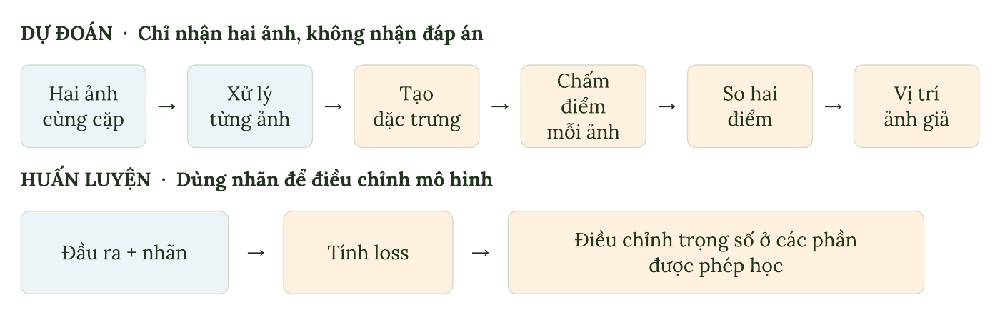
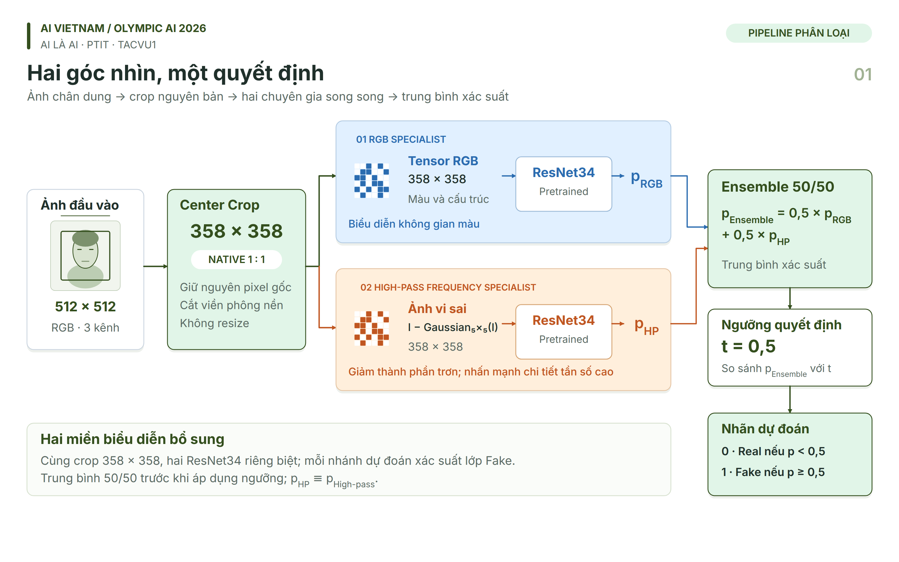

# Olympic AI PTIT 2026 - Vòng sơ loại

Repo gồm lời giải và notebook thực hành cho hai bài toán phân loại ảnh chân dung: **Kẻ Mạo Danh** và **AI Là AI**. Mỗi bài có hướng dẫn riêng, code dùng chung và các notebook để học từng bước hoặc chạy toàn bộ quy trình.

## Chọn bài để bắt đầu

| Bài toán | Đầu vào và nhiệm vụ | Hướng dẫn |
| --- | --- | --- |
| Kẻ Mạo Danh | Một cặp ảnh có đúng một ảnh thật và một ảnh giả. Dự đoán vị trí ảnh giả trong cặp. | [Mở bài Kẻ Mạo Danh](KeMaoDanh/README.md) |
| AI Là AI | Một ảnh chân dung. Phân loại ảnh thật hay ảnh do AI tạo ra. | [Mở bài AI Là AI](AI_LA_AI/README.md) |

## Kẻ Mạo Danh

Bài học bắt đầu từ việc khám phá dữ liệu và xây dựng mô hình cơ sở với Logistic Regression. Sau đó, bạn sẽ thử fine-tuning CNN, so sánh vùng cắt ảnh, chọn backbone và phân tích lỗi trước khi kết hợp mô hình và xuất bài nộp.



Sơ đồ mô tả cách mô hình xử lý một cặp ảnh khi dự đoán và cách dùng nhãn trong quá trình huấn luyện.

Nếu mới học, hãy đi lần lượt qua **8 notebook chính từ 00 đến 07**. Notebook `pipeline_end_to_end.ipynb` gom các bước để chạy lại toàn bộ lời giải; bốn phụ lục A-D dành cho những thử nghiệm muốn tìm hiểu thêm.

Xem [hướng dẫn cài đặt, dữ liệu và chọn notebook](KeMaoDanh/README.md).

## AI Là AI

Bài học đi từ khám phá dữ liệu và cách tính Macro-F1 đến việc so sánh các cách xử lý ảnh. Lời giải dùng hai nhánh ResNet34: nhánh RGB nhận vùng cắt giữ nguyên pixel gốc, nhánh High-pass nhận phần chênh lệch giữa ảnh gốc và ảnh làm mờ Gaussian. Xác suất của hai nhánh được lấy trung bình trước khi phân loại.



Bạn có thể học lần lượt **bài 1 đến bài 3**, rồi mở `00_pipeline_end_to_end.ipynb` để chạy từ dữ liệu đến tệp nộp bài. Bài 4 chạy ba thử nghiệm từ ảnh đến báo cáo so sánh trên GPU, kèm chế độ đọc dự đoán lịch sử trên CPU.

Xem [hướng dẫn cài đặt, chuẩn bị dữ liệu và nội dung từng notebook](AI_LA_AI/README.md).

## Cấu trúc repo

```text
.
├── README.md
├── assets/       # Tài liệu và hình minh họa dùng chung
├── KeMaoDanh/    # Code và notebook bài Kẻ Mạo Danh
└── AI_LA_AI/     # Code và notebook bài AI Là AI
```

Hãy giữ nguyên cấu trúc thư mục khi tải repo để notebook tìm được code, cấu hình và các tệp hỗ trợ. Hướng dẫn cài đặt và chuẩn bị dữ liệu nằm trong README của từng bài.
