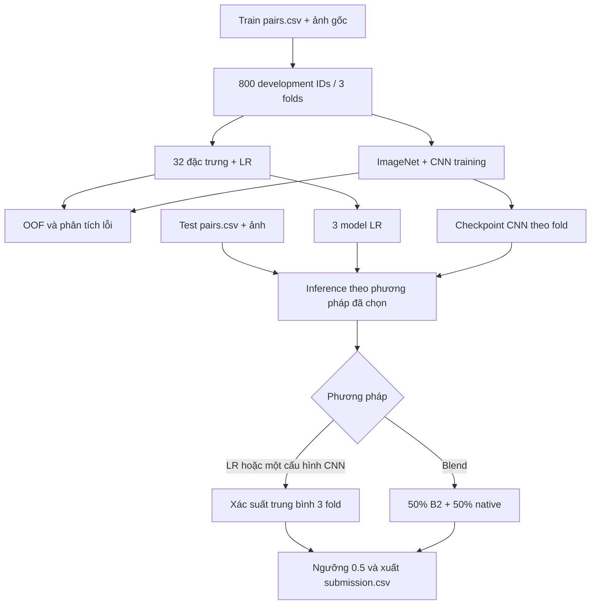

# Sơ đồ theo bài

## Kẻ mạo danh

```mermaid
flowchart TD
  A[Train pairs.csv + ảnh gốc] --> B[800 development IDs / 3 folds]
  B --> C[32 đặc trưng + LR]
  B --> D[ImageNet + CNN training]
  C --> E[OOF và phân tích lỗi]
  D --> E
  C --> F[3 model LR]
  D --> G[Checkpoint CNN theo fold]
  T[Test pairs.csv + ảnh] --> H[Inference theo phương pháp đã chọn]
  F --> H
  G --> H
  H --> I{Phương pháp}
  I -->|LR hoặc một cấu hình CNN| J[Xác suất trung bình 3 fold]
  I -->|Blend| K[50% B2 + 50% native]
  J --> L[Ngưỡng 0.5 và xuất submission.csv]
  K --> L
```

Khi chưa có test, pipeline dừng sau huấn luyện và đánh giá OOF; không tạo submission.
